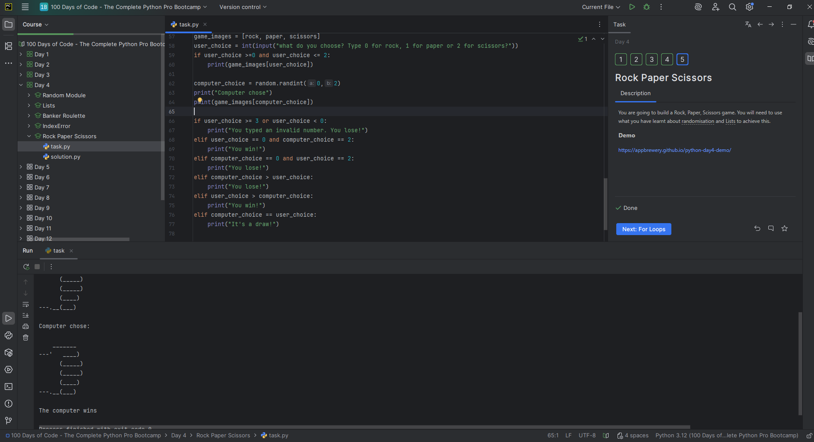
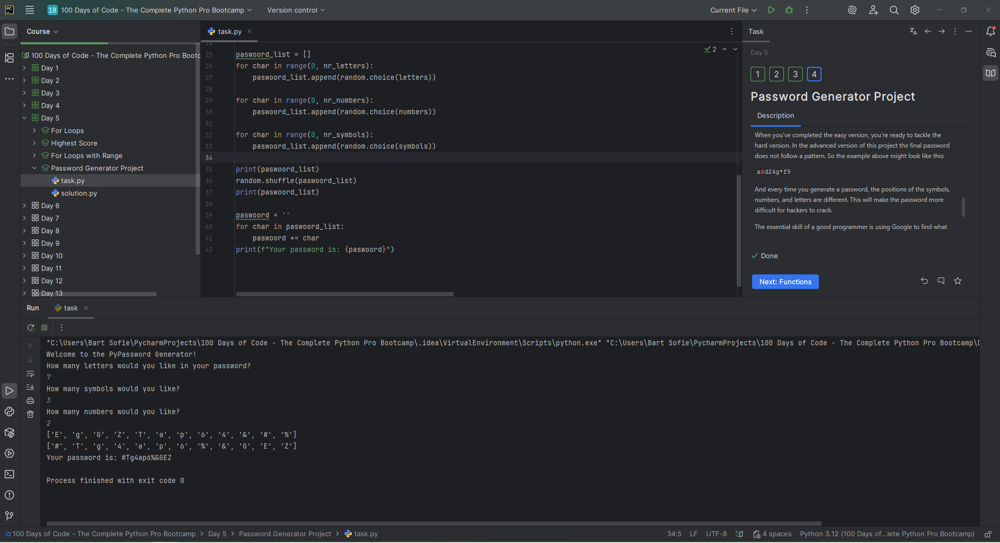

# 📚 Logboek Python Zelfstudie – Bart Brondeel

> **Periode:** 15 oktober 2025 – 06 juni 2026
> **Doel:** Oefenen met Python via zelfstudie (Udemy + praktijkvoorbeelden)  

---

## 🗓️ Week 25W43 (20.10.25 – 24.10.25)

### 📅 Maandag 20/10
*Start:* 18:20 | *Einde:* 20:20 | *Dag:* 4 
*Onderwerp:* Random en lijsten
*Printscreen*

### 📅 Dinsdag 21/10
*Start:* 18:00 | *Einde:* 20:00 | *Dag:* 5 
*Onderwerp:* For loop in combinatie met lijsten en de functie range
*Printscreen*

