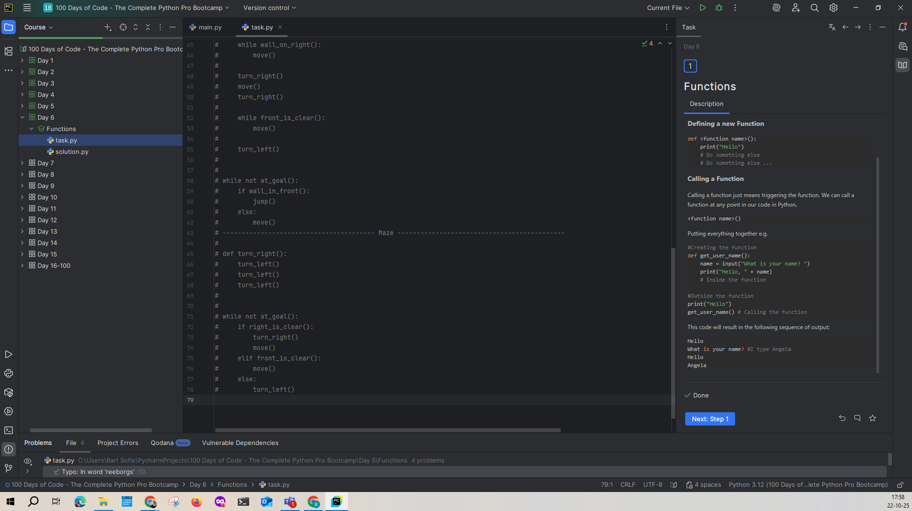
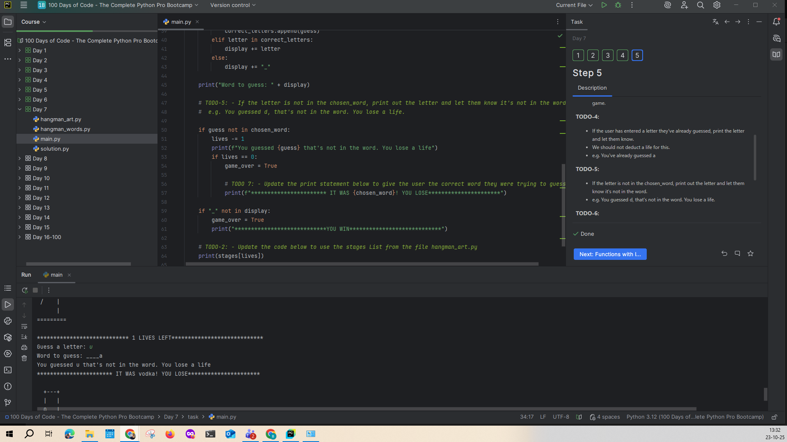
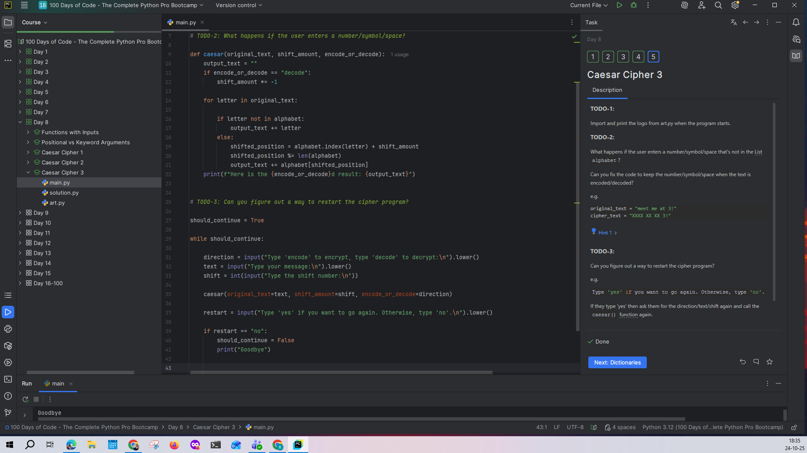

### 🗓️ Week 25W43 (20.10.25 – 24.10.25)

## 📅 Maandag 20/10
*Start:* 18:20 | *Einde:* 20:20 | *Dag:* 4 
*Onderwerp:* Random en lijsten
*Printscreen*

## 📅 Dinsdag 21/10
*Start:* 18:00 | *Einde:* 20:00 | *Dag:* 5 
*Onderwerp:* For loop in combinatie met lijsten en de functie range
*Printscreen*

## 📅 Woensdag 22/10
*Start:* 14:45 | *Einde:* 17:45 | *Dag:* 6 
*Onderwerp:* while loops en functies
*Printscreen*

## 📅 Donderdag 23/10
*Start:* 09:15 | *Einde:* 13:15 | *Dag:* 7 
*Onderwerp:* Alles wat we tot hiertoe hebben gezien oefenen (HANGMAN game gemaakt)
*Printscreen*

## 📅 Vrijdag 24/10
*Start:* 15:245 | *Einde:* 17:45 | *Dag:* 8
*Onderwerp:* Functies met input
*Printscreen*

