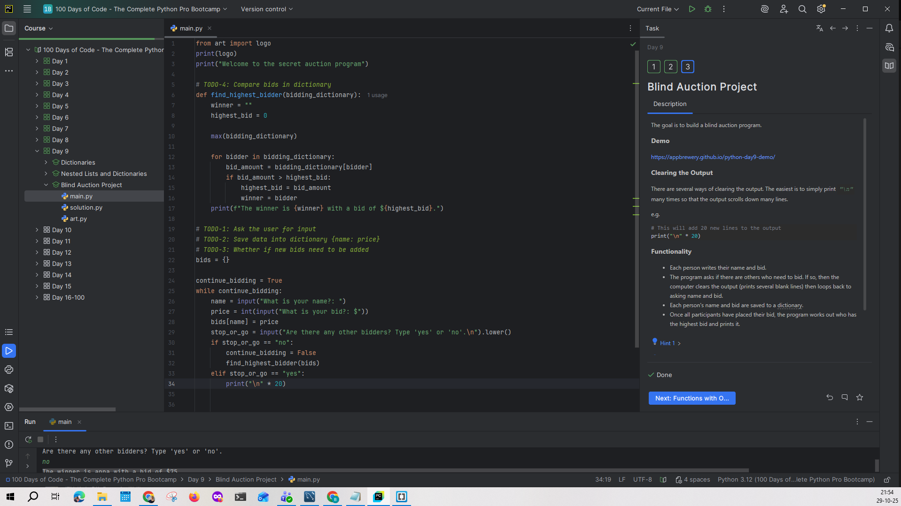
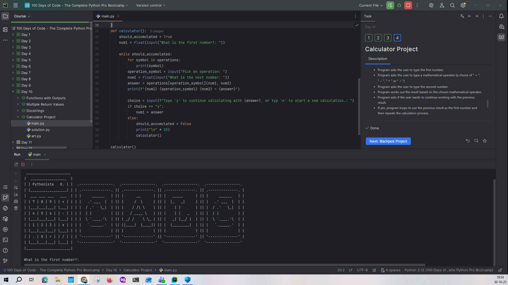
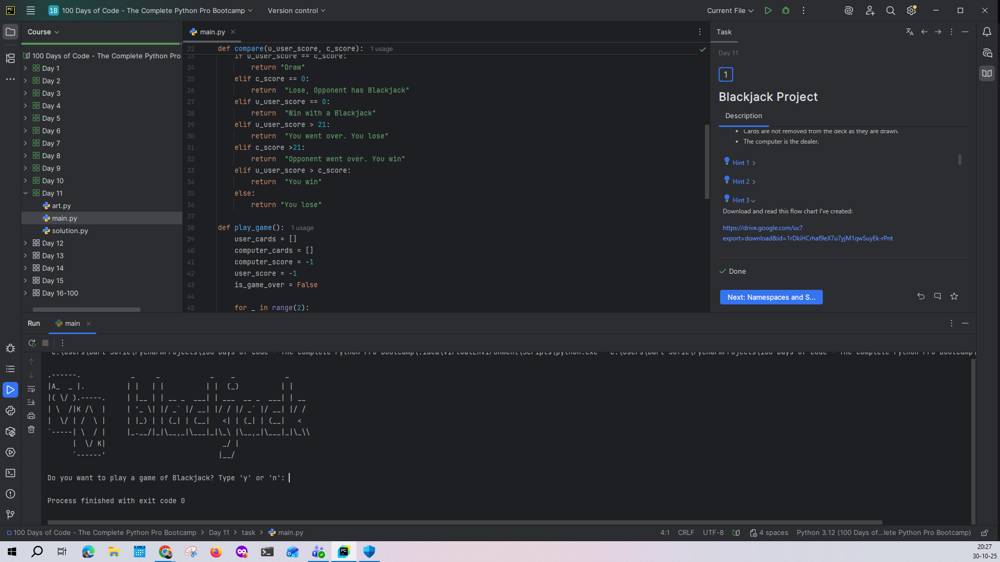
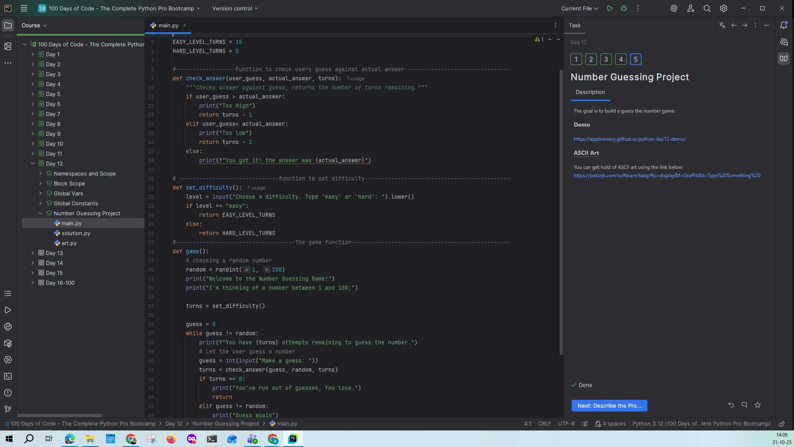

### 🗓️ Week 25W44 (27.10.25 – 31.10.25)

## 📅 Maandag 27/10
*Start:* 00:00 | *Einde:* 00:00 | *Dag:* 
*Onderwerp:* verlof

## 📅 Dinsdag 28/10
*Start:* 00:00 | *Einde:* 00:00 | *Dag:* 
*Onderwerp:* verlof

## 📅 Woensdag 29/10
*Start:* 20:00 | *Einde:* 21:45 | *Dag:* 9 
*Onderwerp:* Dictionaries als oefening een geheime veilings app (secret auction program)
*Printscreen*

## 📅 Donderdag 30/10
*Start:* 15:30 | *Einde:* 20:30 | *Dag:* 10 en 11 
*Onderwerp:* Functies met output, Docstrings, Calculator en Blackjack
*Printscreen*

## 📅 Vrijdag 24/10
*Start:* 00:00 | *Einde:* 00:00 | *Dag:* 13 
*Onderwerp:* Scop en het spel raad het nummer (The Number Guessing Game
*Printscreen*

