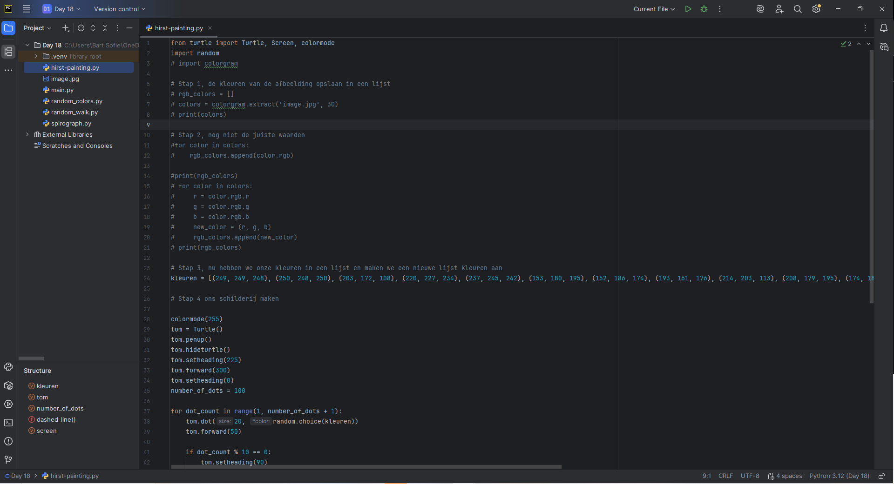
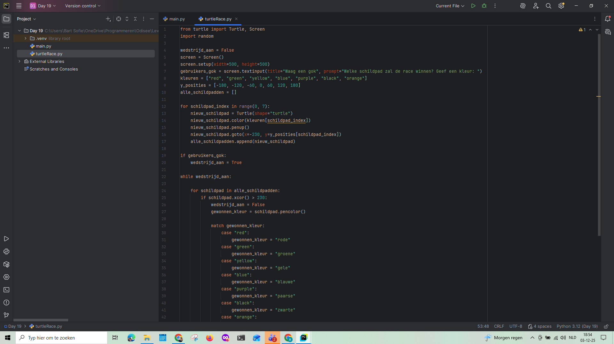
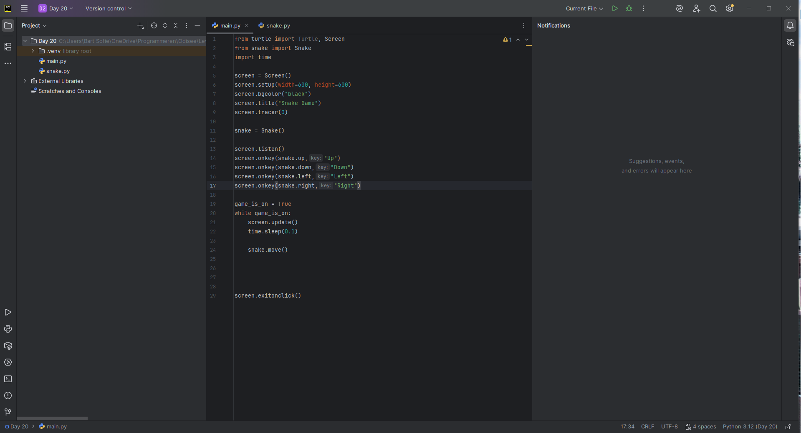
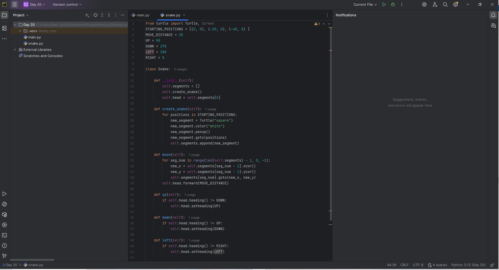
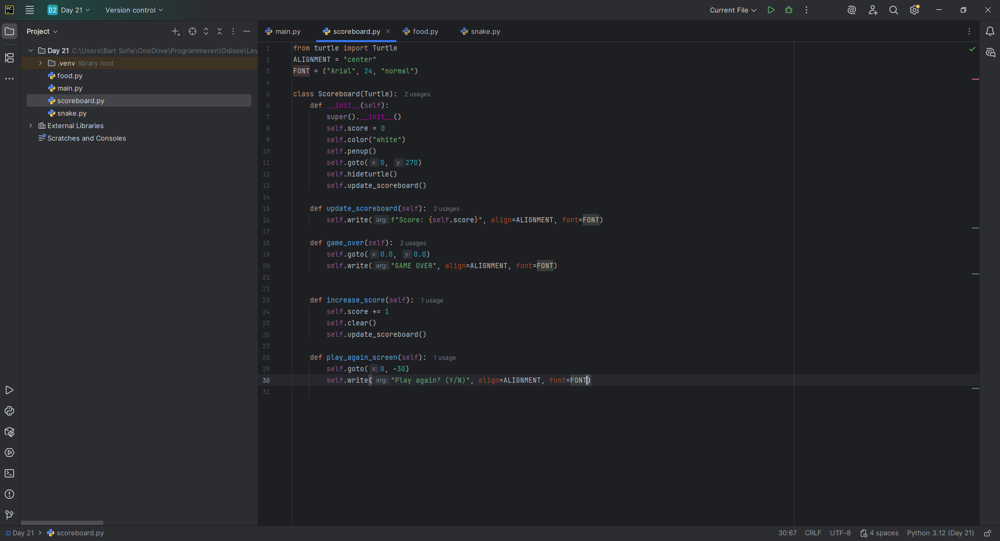
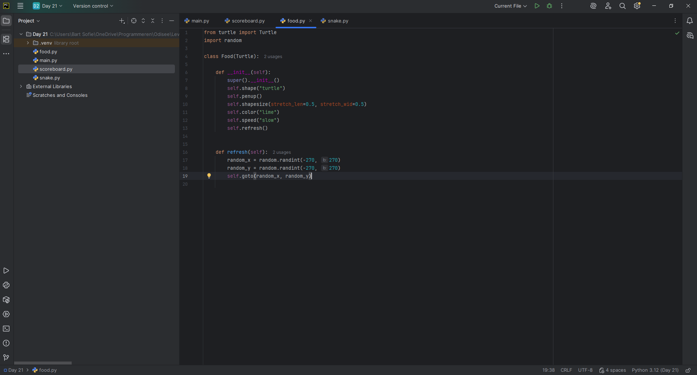
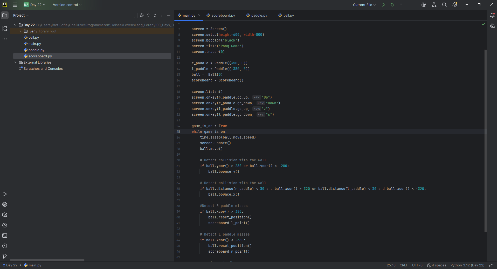
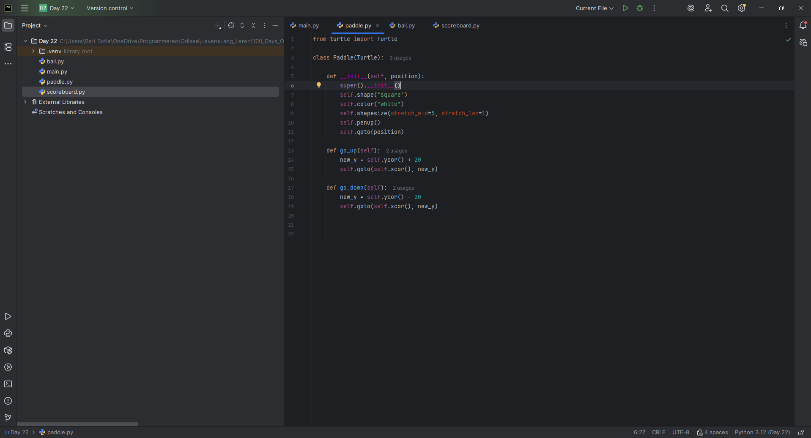
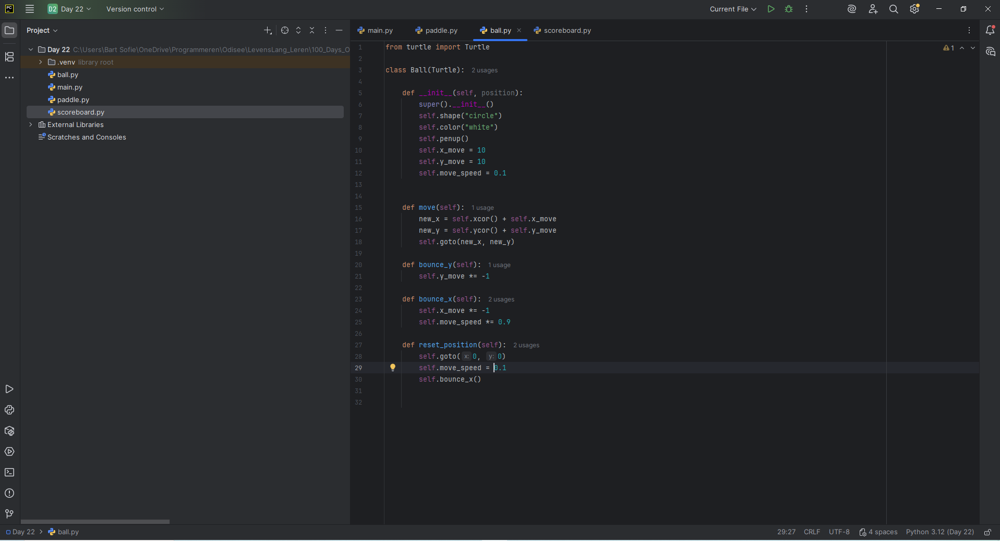

### 🗓️ Week 25W49 (01.12.25 – 04.12.25)

## 📅 Maandag 01/12
*Start:* 14:00 | *Einde:* 20:00 | *Dag:* 17  
*Onderwerp:* Quiz Game
*Printscreen*

## 📅 Dinsdag 02/12
*Start:* 00:00 | *Einde:* 00:00 | *Dag:* 18  
*Onderwerp:*    Tekenen, Tuple, random_walk, spirograph, dots tekenen
*Printscreen*

## 📅 Woensdag 03/12
*Start:* 00:00 | *Einde:* 00:00 | *Dag:* 19  
*Onderwerp:* Schildpadden Race
*Printscreen*

## 📅 Donderdag 04/12
*Start:* 00:00 | *Einde:* 00:00 | *Dag:* 20   
*Onderwerp:* Snake Game deel 1 
*Printscreen*

## 📅 Vrijdag 05/12
*Start:* 00:00 | *Einde:* 00:00 | *Dag:* 21  
*Onderwerp:* Snake Game deel 2, Class Inheritance
*Printscreen*

## 📅 Zaterdag 06/12
*Start:* 00:00 | *Einde:* 00:00 | *Dag:* 22  
*Onderwerp:* Pong Game
*Printscreen*

