### 🗓️ Week 25W50 (08.12.25 – 12.12.25)

## 📅 Maandag 08/12
*Start:* 09:30 | *Einde:* 11:30 | *Dag:* 23  
*Onderwerp:* The turtlecrossing game  
*Printscreen*

## 📅 Dinsdag 09/12
*Start:* 14:00 | *Einde:* 16:00 | *Dag:* 24  
*Onderwerp:* Bestanden lezen, schrijven en sluiten  
*Printscreen*
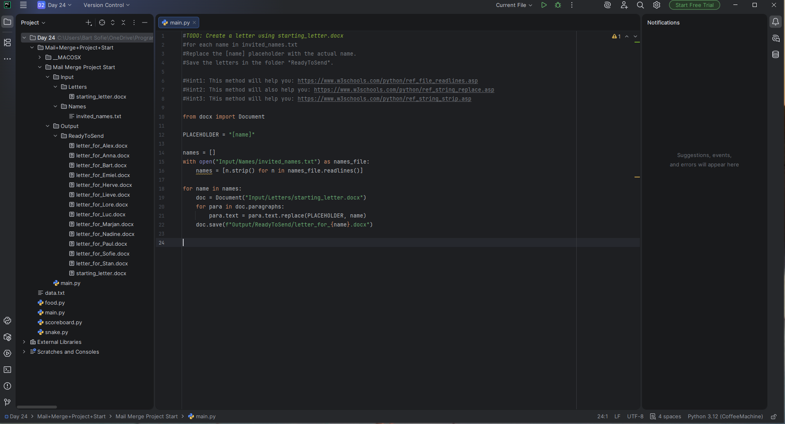

## 📅 Woensdag 10/12
*Start:* 13:30 | *Einde:* 15:30 | *Dag:* 25  
*Onderwerp:* csv bestanden importeren (Pandas), nieuwe aanmaken, US state name Quiz  
*Printscreen*
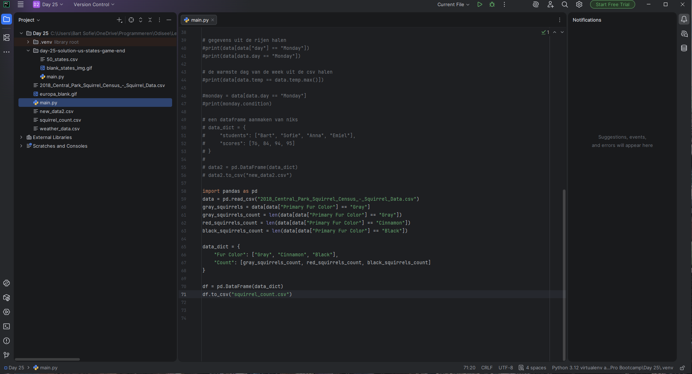
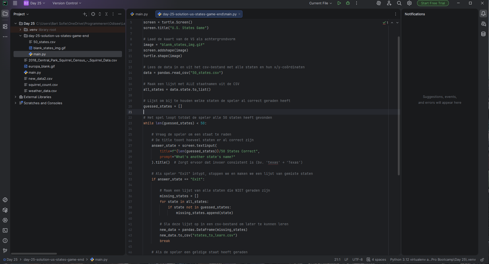

## 📅 Donderdag 11/12
*Start:* 13:00 | *Einde:* 16:00 | *Dag:* 26  
*Onderwerp:* Lists and dictionary comprehension  
*Printscreen*
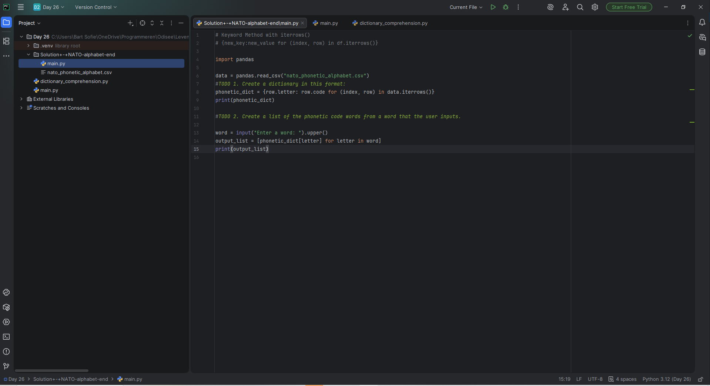
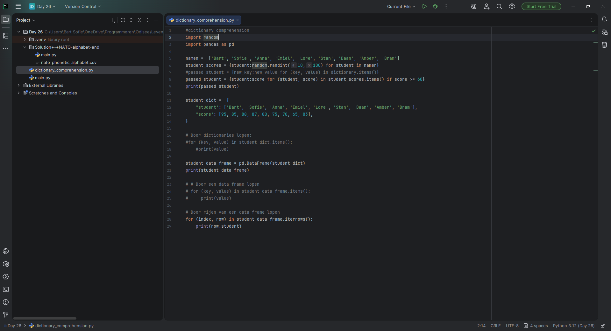
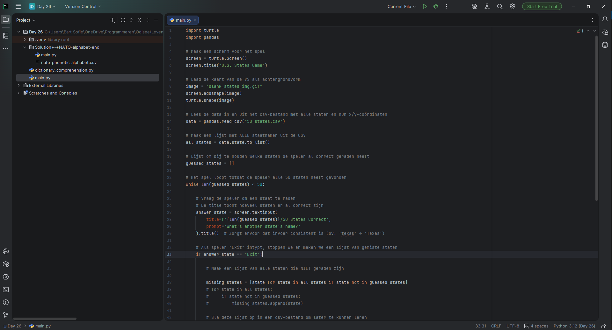

## 📅 Vrijdag 12/12
*Start:* 09:00 | *Einde:* 11:00 | *Dag:* 27  
*Onderwerp:* Import tkinter, first GUI program  
*Printscreen*
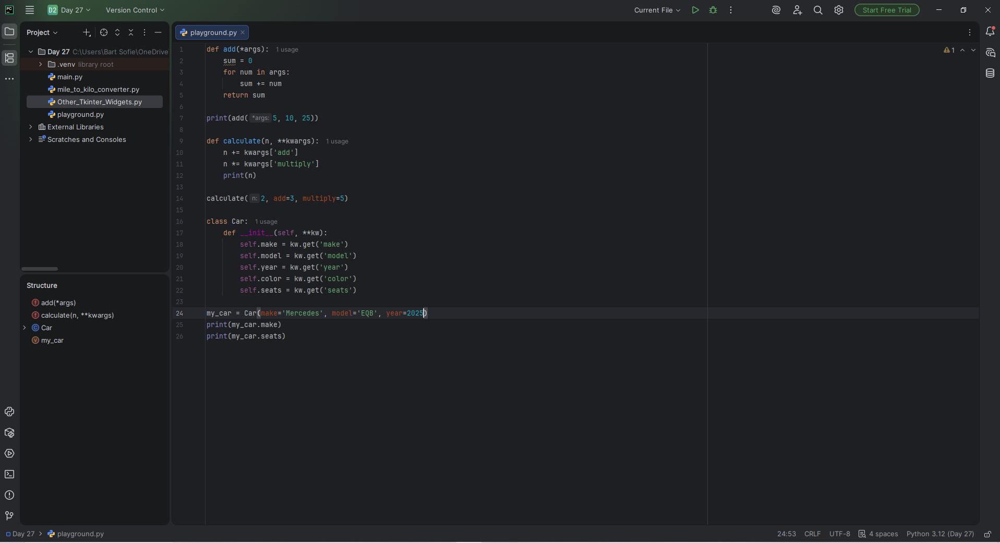
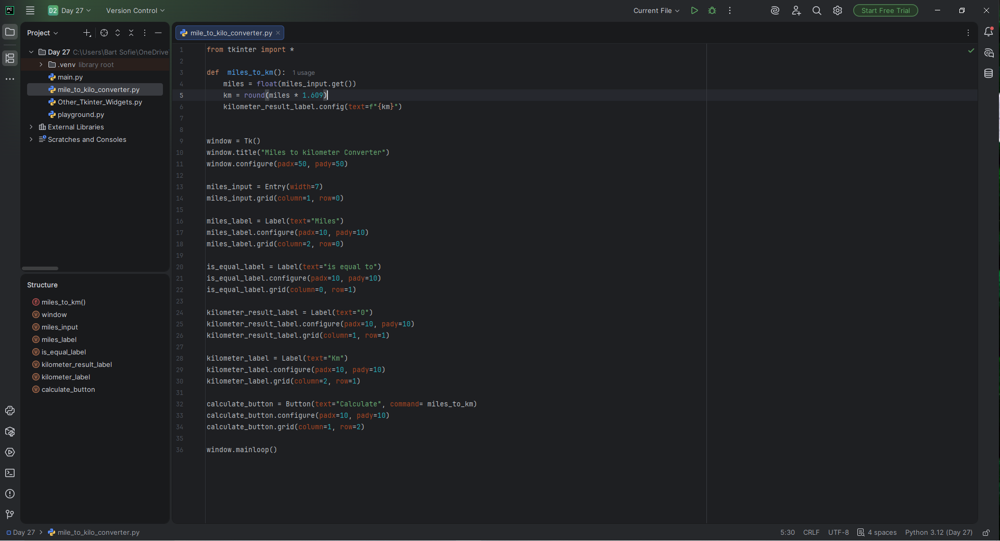

## 📅 Zaterdag 13/12
*Start:* 08:00 | *Einde:* 11:00 | *Dag:* 28  
*Onderwerp:* BlokTimer  
*Printscreen*
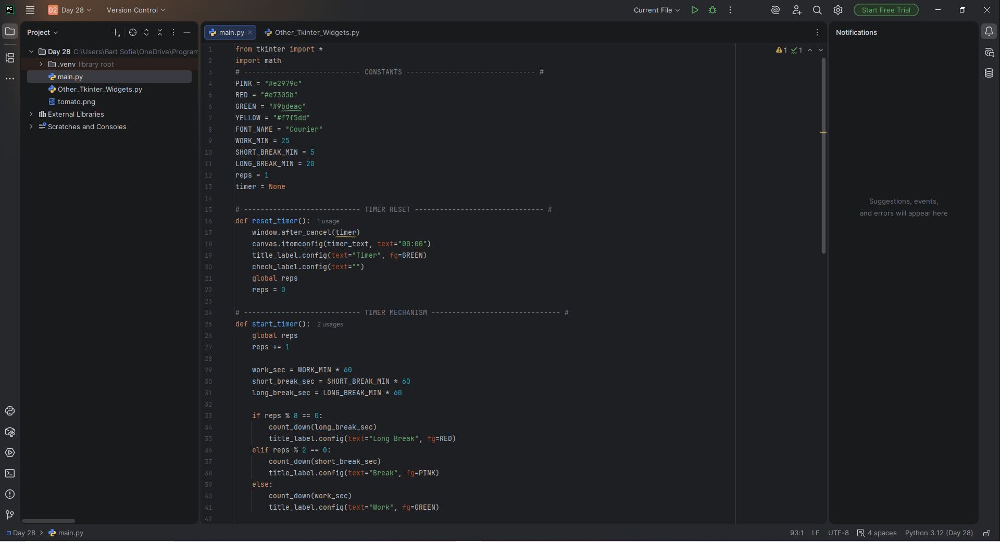
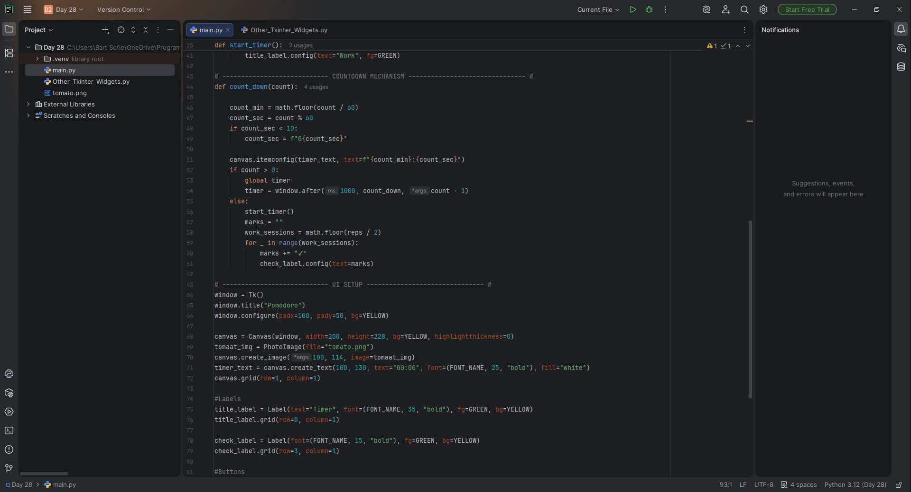
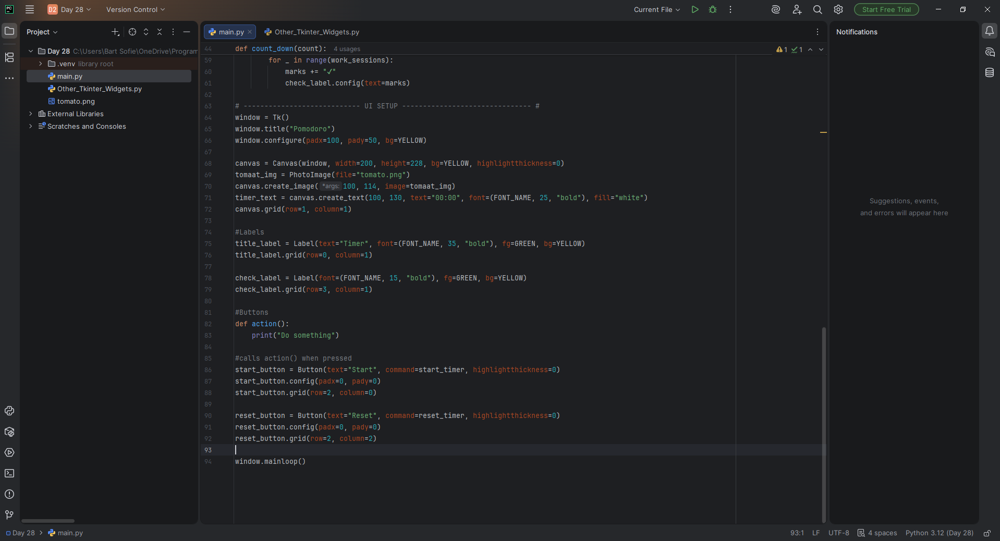