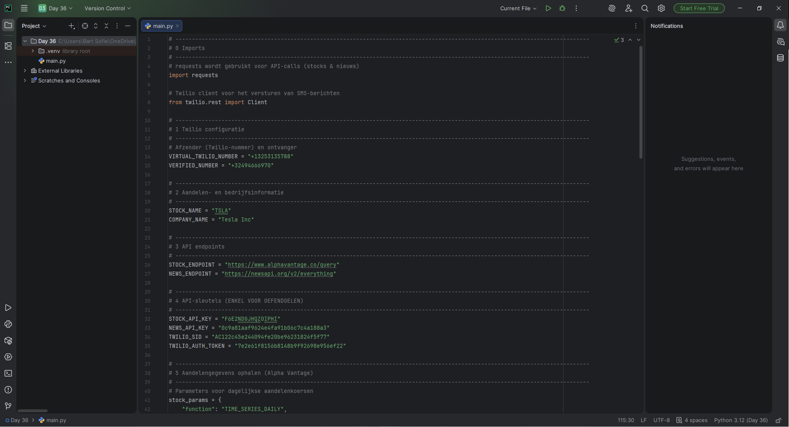
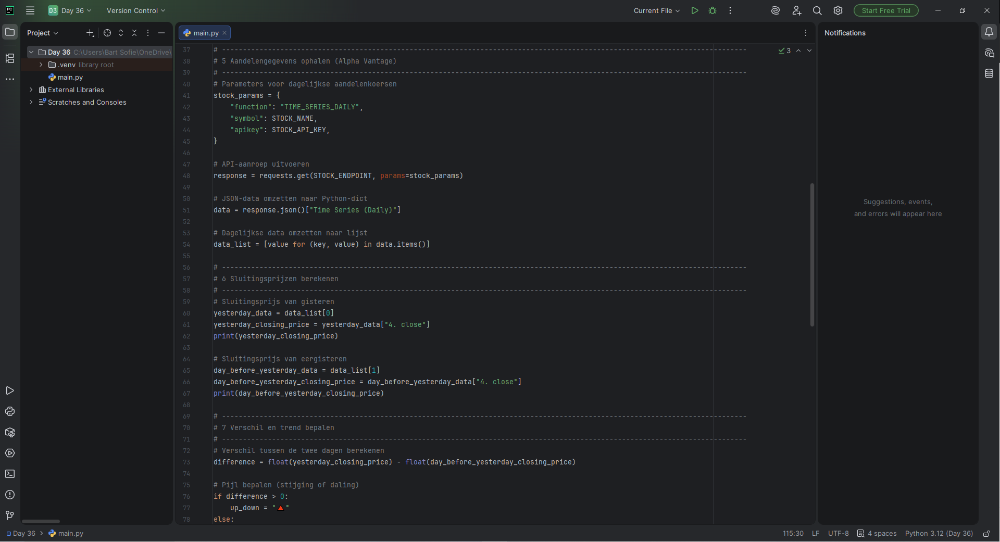
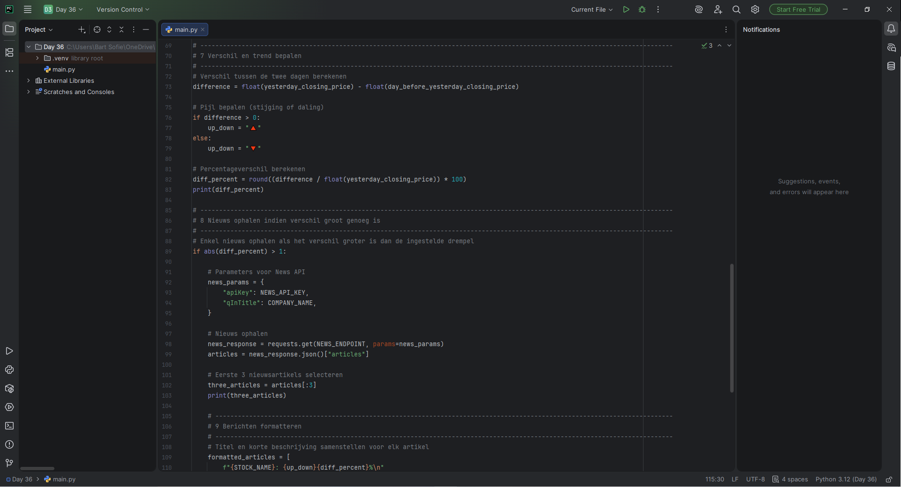
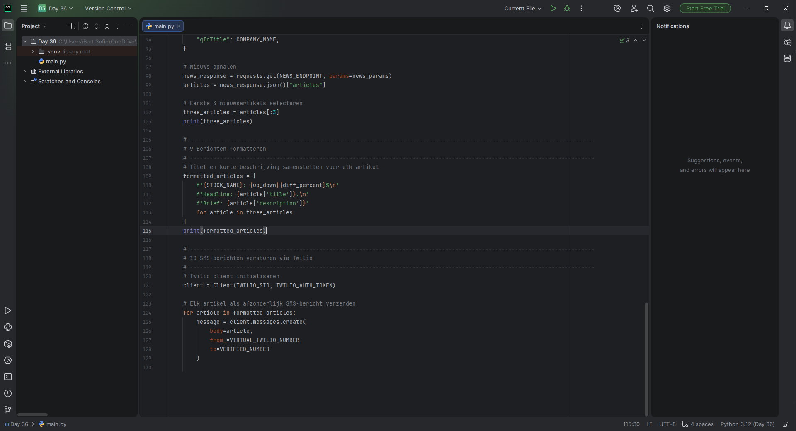

### 🗓️ Week 25W51 (22.12.25 – 26.12.25)

## 📅 Maandag 22/12
*Start:* 00:00 | *Einde:* 00:00 | *Dag:* 00  
*Onderwerp:* Verlof dagje genomen  
*Printscreen*

## 📅 Dinsdag 23/12
*Start:* 13:00 | *Einde:* 16:00 | *Dag:* 35  
*Onderwerp:* Sending SMS via the Twilio API  
*Printscreen*

## 📅 Woensdag 24/12
*Start:* 10:00 | *Einde:* 12:00 | *Dag:* 36  
*Onderwerp:* Stock News Monitoring Project  
*Printscreen*

## 📅 Donderdag 25/12
*Start:* 00:00 | *Einde:* 00:00 | *Dag:*
*Onderwerp:* ...
*Printscreen*

## 📅 Vrijdag 26/12
*Start:* 00:00 | *Einde:* 00:00 | *Dag:* 
*Onderwerp:* ...
*Printscreen*

