### 🗓️ Week 26W18 (27.04.26 – 01.05.26)

## 📅 Maandag 27/04
*Start:* 07:00 | *Einde:* 18:30 |  *Dag: 52, 53, 54, 55*  
*Onderwerp:* extra oefeningen scraping  
*Printscreen Day 52 instagram bot*
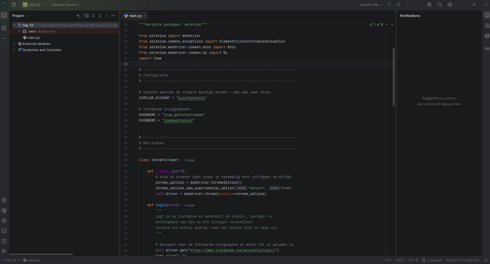
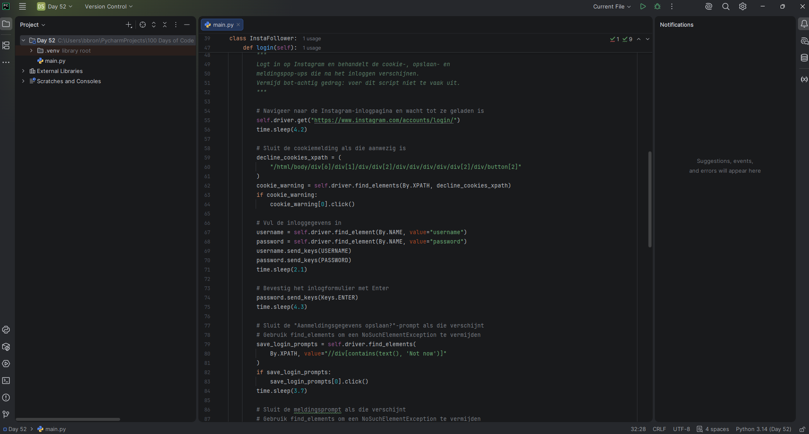
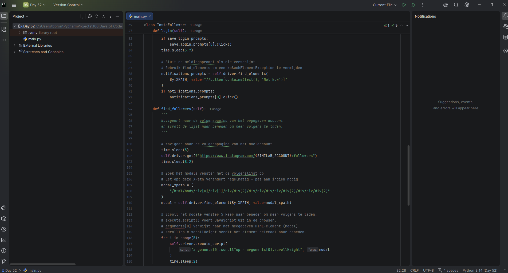
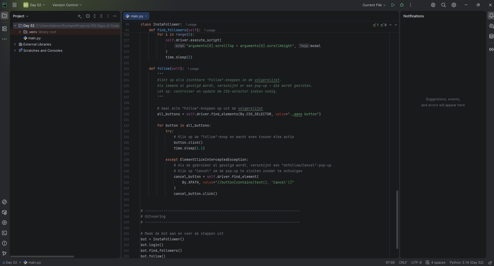  
 *Printscreen Day 53 web scraping capstone* 
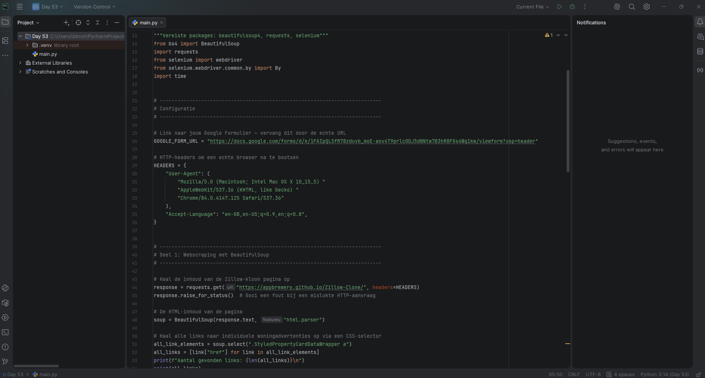
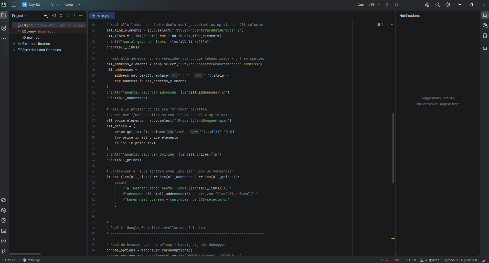
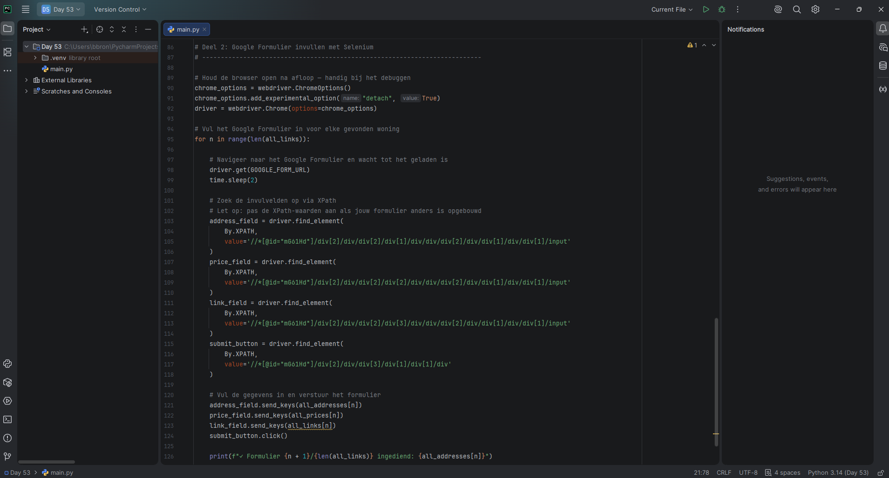  
 *Printscreen Day 54 flask: web server, functions, nesting functions, decorator* 
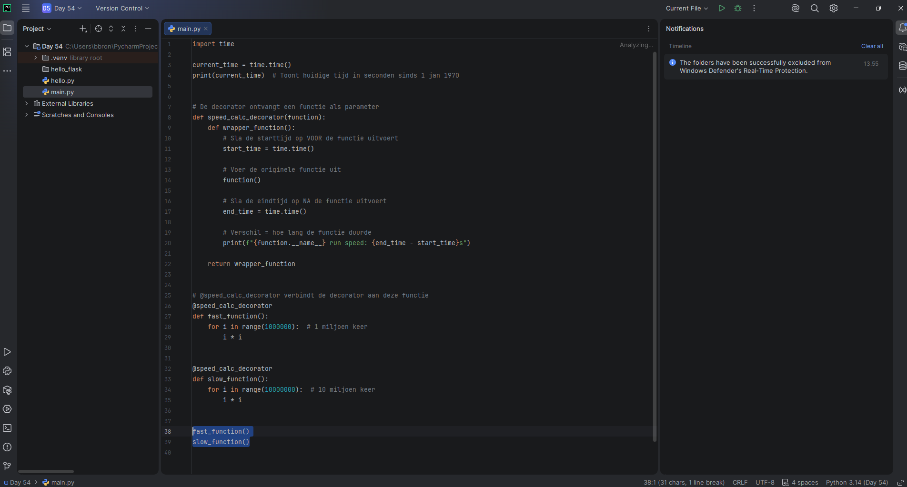
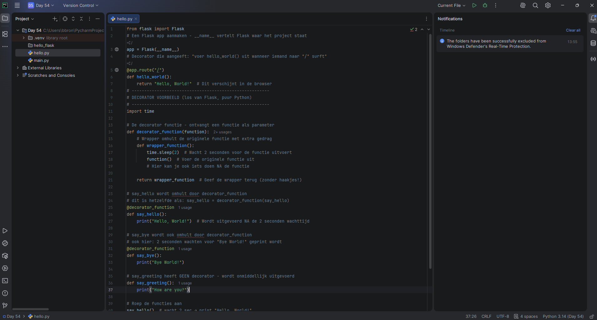  
 *Printscreen Day 55 flask: URL Paths, Debugger, rendering HTML elements, *args and **kwarks* 
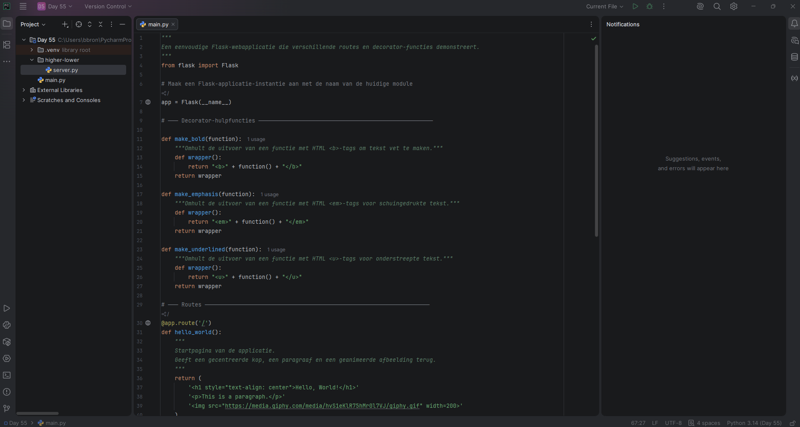
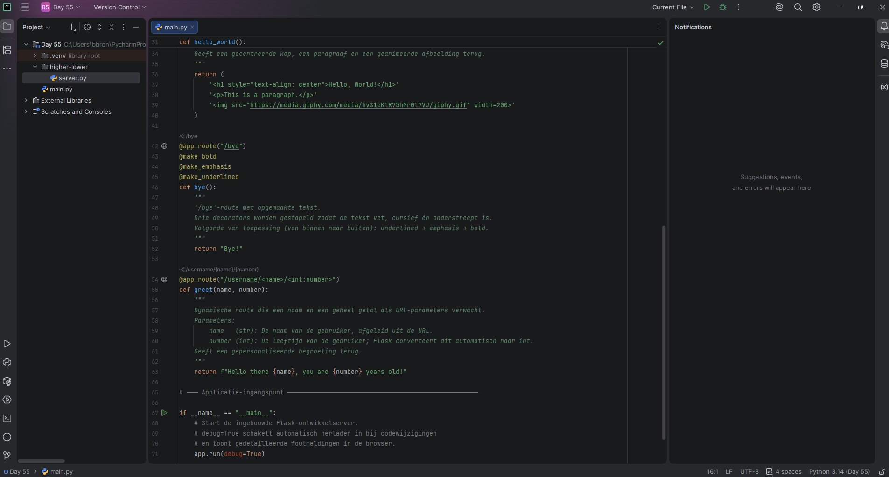
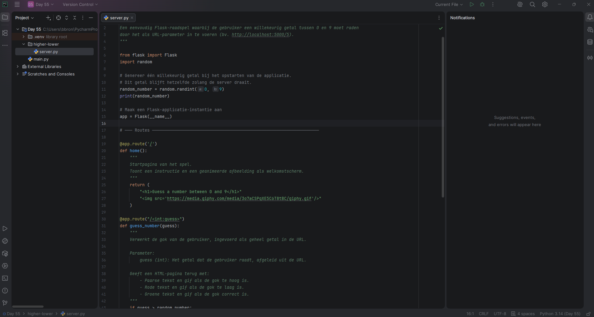
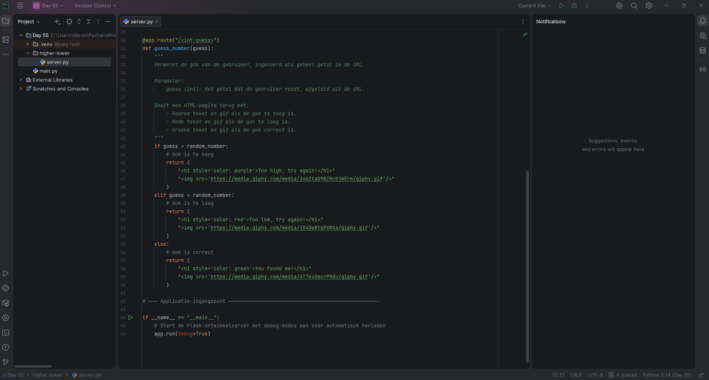

## 📅 Dinsdag 28/04
*Start:* 00:00 | *Einde:* 00:00 |  *Dag:*  
*Onderwerp:* ................  
*Printscreen*

## 📅 Woensdag 29/04
*Start:* 00:00 | *Einde:* 00:00 | *Dag:*   
*Onderwerp:* ................  
*Printscreen*

## 📅 Donderdag 30/04
*Start:* 00:00 | *Einde:* 00:00 | *Dag:*   
*Onderwerp:* ................  
*Printscreen*

## 📅 Vrijdag 01/05
*Start:* 00:00 | *Einde:* 00:00 | *Dag:*   
*Onderwerp:* ................  
*Printscreen*

