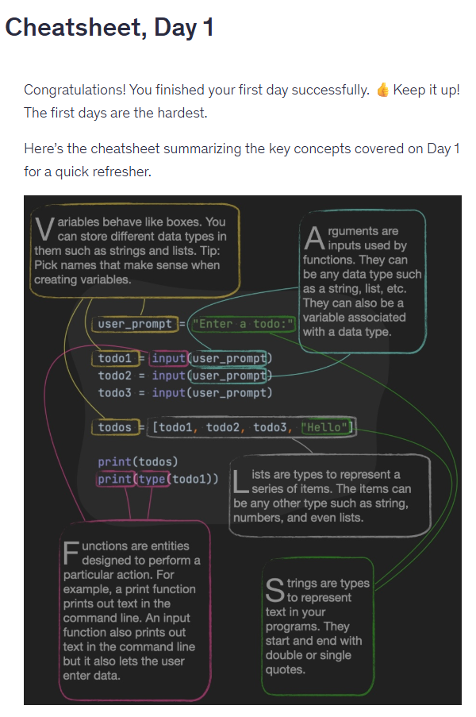
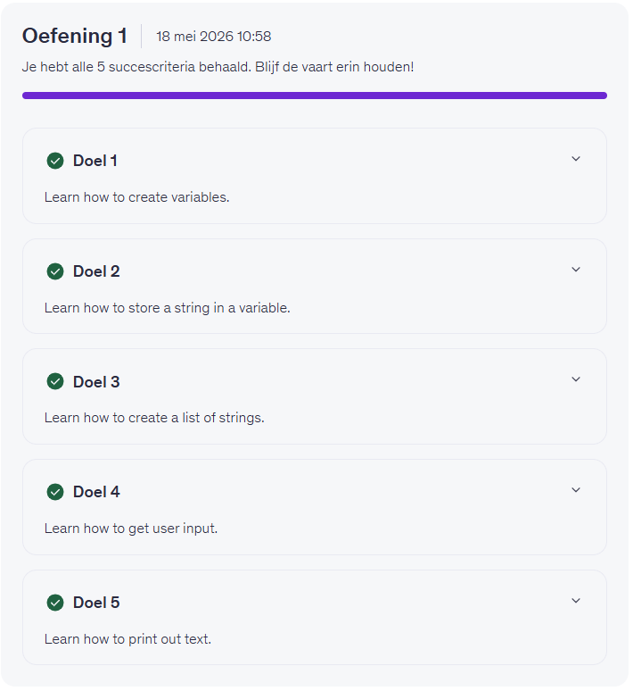
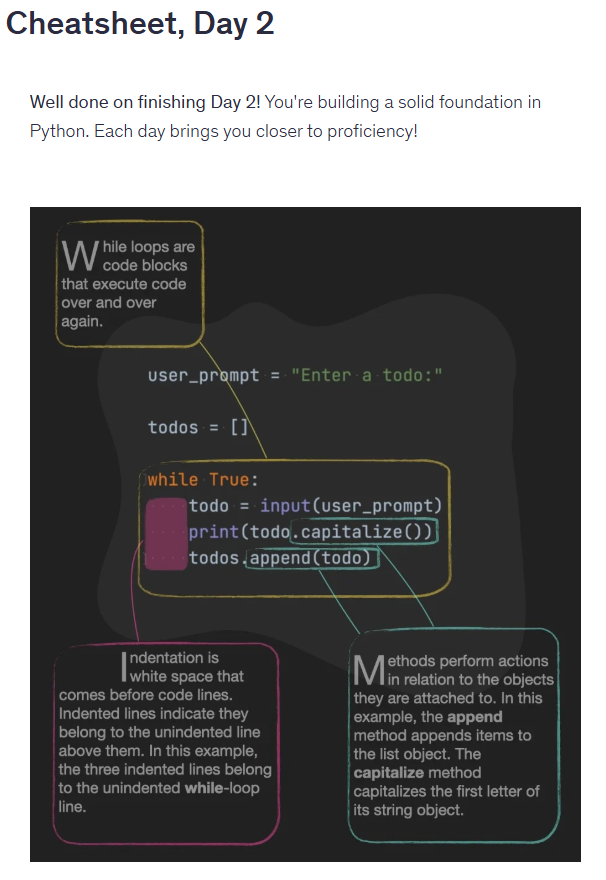
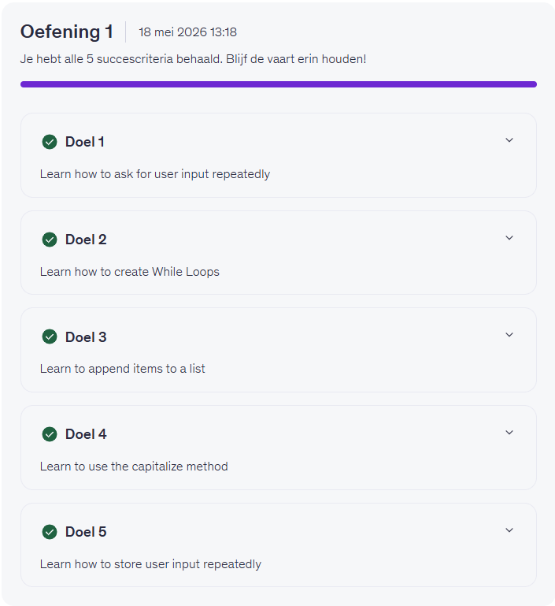

### 🗓️ Week 26W21 (19.05.26 – 23.05.26)

## 📅 Maandag 19/05
*Start:* 09:00 | *Einde:* 00:00 |  *Dag: 1, 2*  
*Onderwerp:* First Steps: Capturing and Storing User Input (Variabels, User Input, Lists)  
*Printscreen Day 1*

  
  *Printscreen Day 2*  

## 📅 Dinsdag 20/05
*Start:* 00:00 | *Einde:* 00:00 |  *Dag:*  
*Onderwerp:* ................  
*Printscreen*

## 📅 Woensdag 21/05
*Start:* 00:00 | *Einde:* 00:00 | *Dag:*   
*Onderwerp:* ................  
*Printscreen*

## 📅 Donderdag 22/05
*Start:* 00:00 | *Einde:* 00:00 | *Dag:*   
*Onderwerp:* ................  
*Printscreen*

## 📅 Vrijdag 23/05
*Start:* 00:00 | *Einde:* 00:00 | *Dag:*   
*Onderwerp:* ................  
*Printscreen*

