### 🗓️ Week 26W21 (19.05.26 – 23.05.26)

## 📅 Maandag 18/05
*Start:* 09:00 | *Einde:* 18:00 |  *Dag: 1, 2, 3, 4 *  
*Onderwerp:* First Steps: Capturing and Storing User Input (Variabels, User Input, Lists)  
*Printscreen Day 1*  

  
*Onderwerp:* Make Your App Interactive (Methodes, While Loops)  
  *Printscreen Day 2*  

  
*Onderwerp:* Control Program Flow for Smart Features (Match-Case, For Loops)  
  *Printscreen Day 3*  
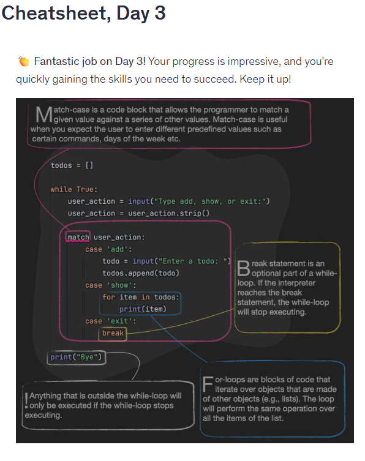
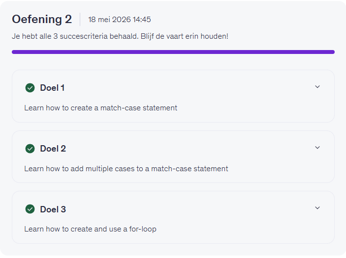  
*Onderwerp:* Manipulate Data (List Indexing, Tuples)  
  *Printscreen Day 4*  
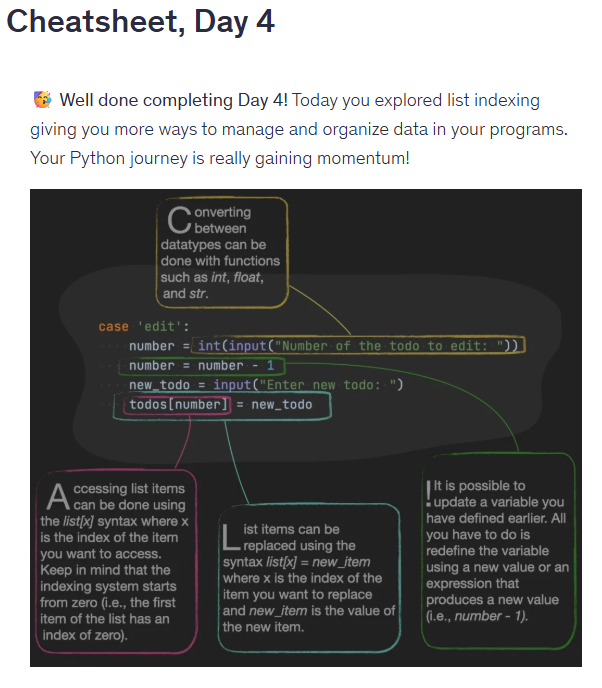
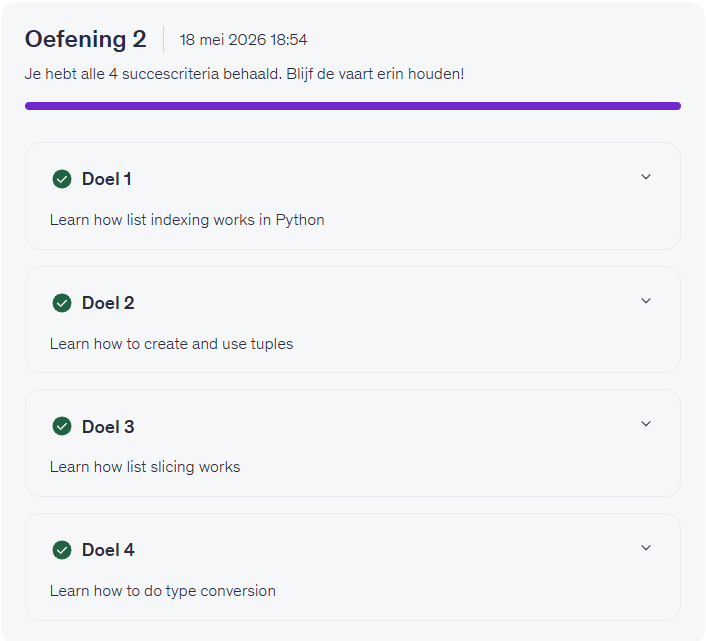  

## 📅 Dinsdag 19/05
*Start:* 08:00 | *Einde:* 19:00 |  *Dag: 5, 6, 7, 8 *  
*Onderwerp:* Display and Structure Output (Enumeration, f-strings)  
*Printscreen Day 5*
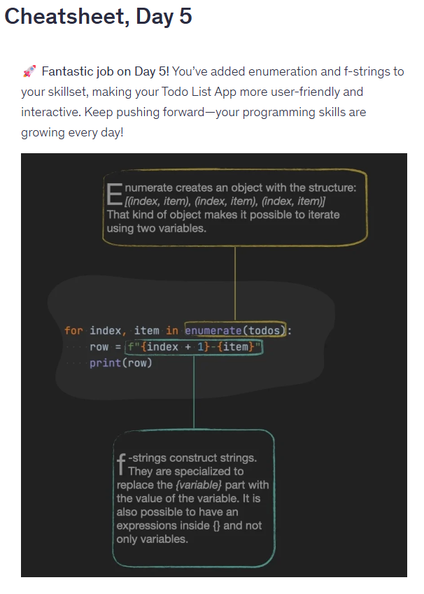
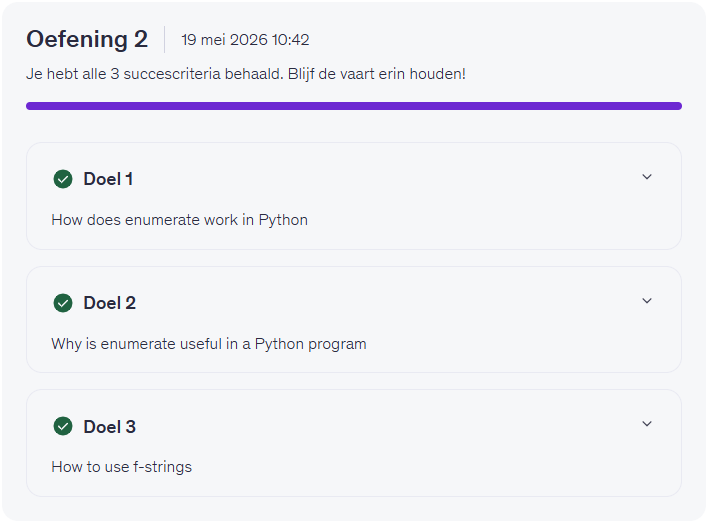  
*Onderwerp:* Persist Data with Files (Processing Text Files, Reading, Writing)  
*Printscreen Day 6*
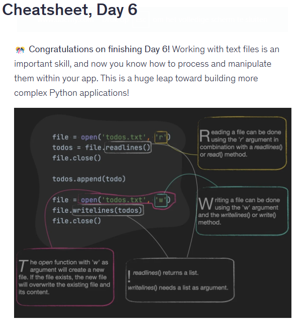
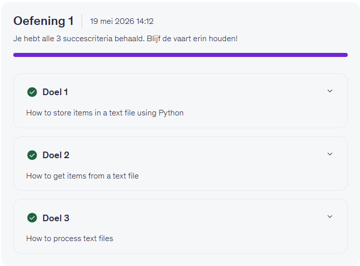  
*Onderwerp:* Optimize and Annotade Your Code (List Comprehensions, Code Comments)  
*Printscreen Day 7*
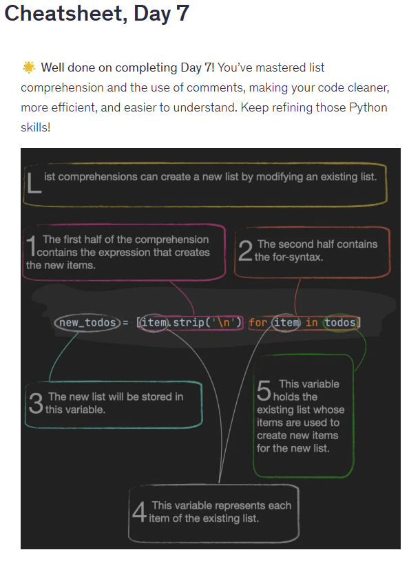
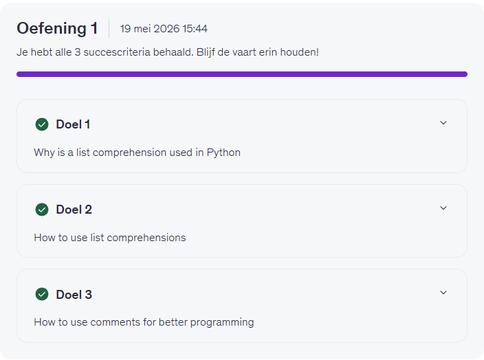  
*Onderwerp:* Master File Management (Context Managers, With Statement)  
*Printscreen Day 8*
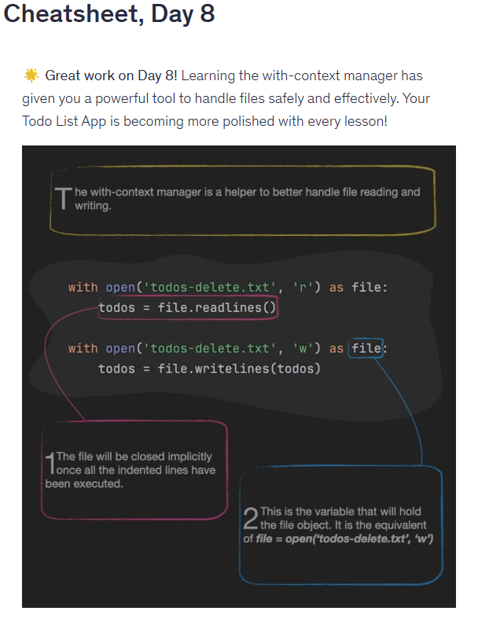
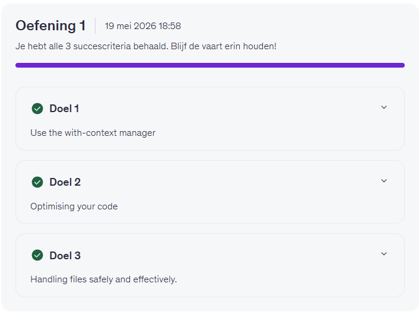  

## 📅 Woensdag 20/05
*Start:* 00:00 | *Einde:* 00:00 | *Dag:*   
*Onderwerp:* ................  
*Printscreen*

## 📅 Donderdag 21/05
*Start:* 00:00 | *Einde:* 00:00 | *Dag:*   
*Onderwerp:* ................  
*Printscreen*

## 📅 Vrijdag 22/05
*Start:* 00:00 | *Einde:* 00:00 | *Dag:*   
*Onderwerp:* ................  
*Printscreen*

