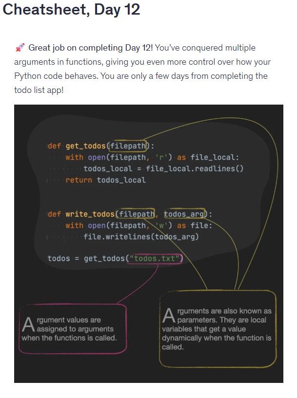
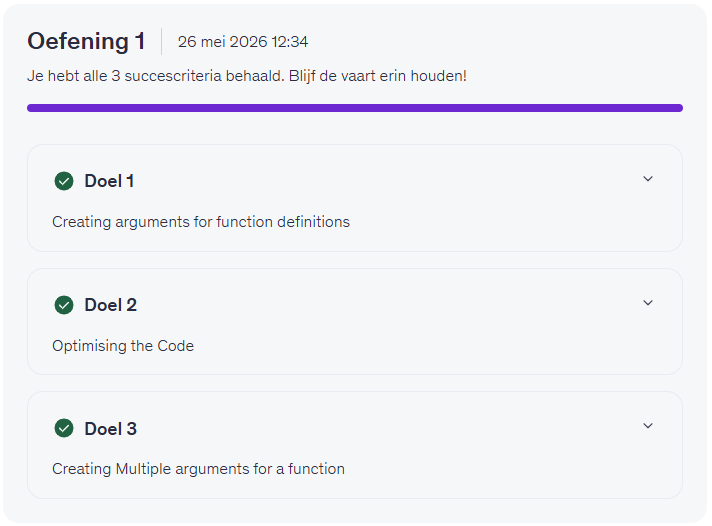
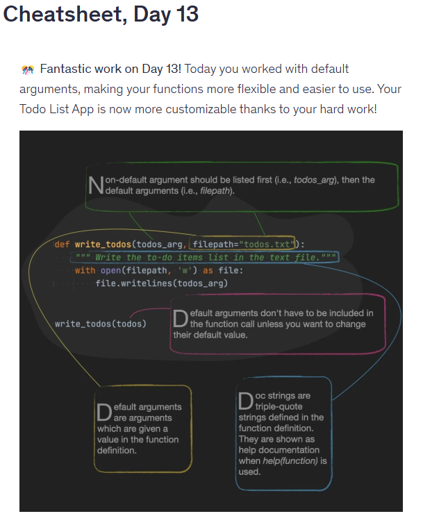
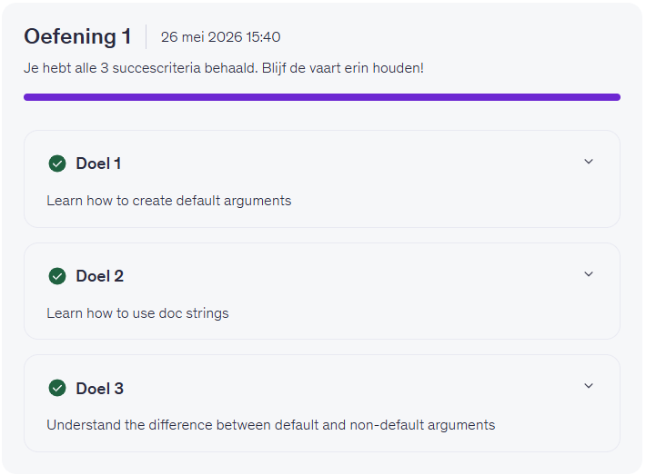
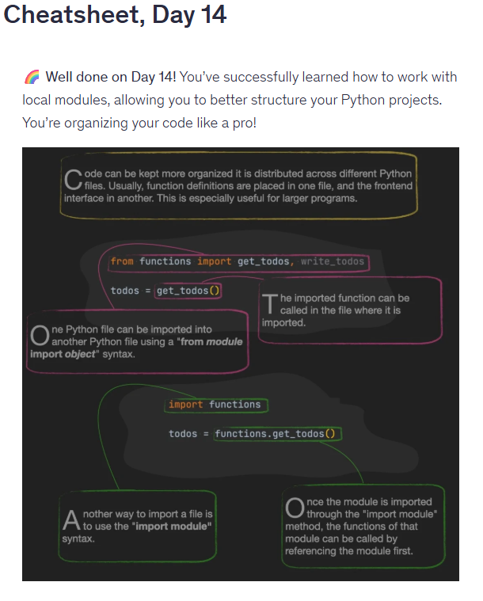
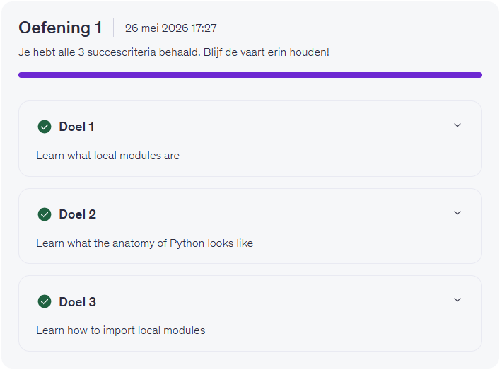
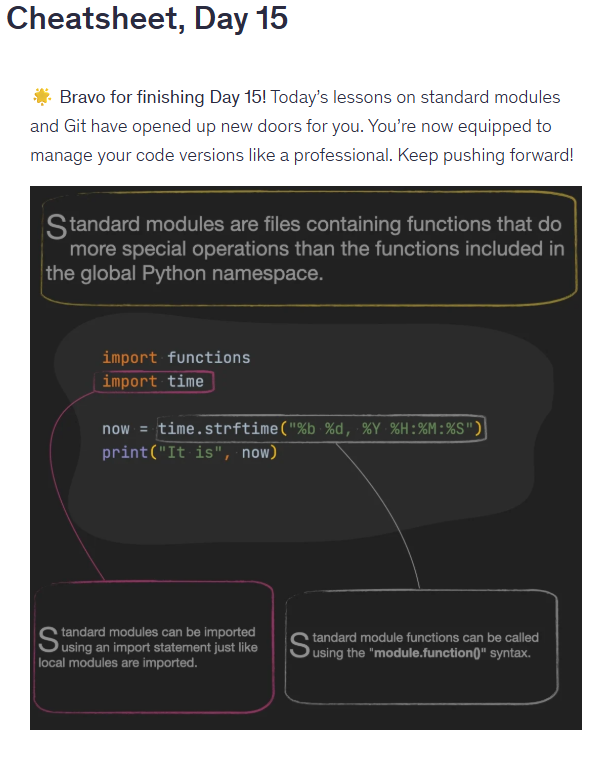
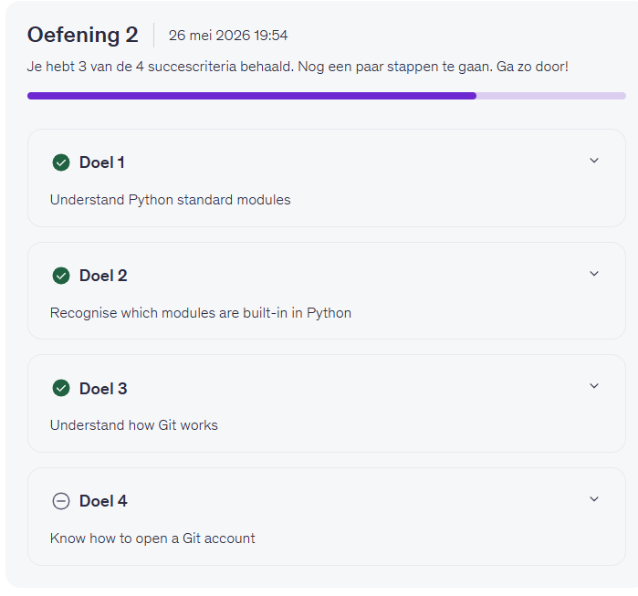
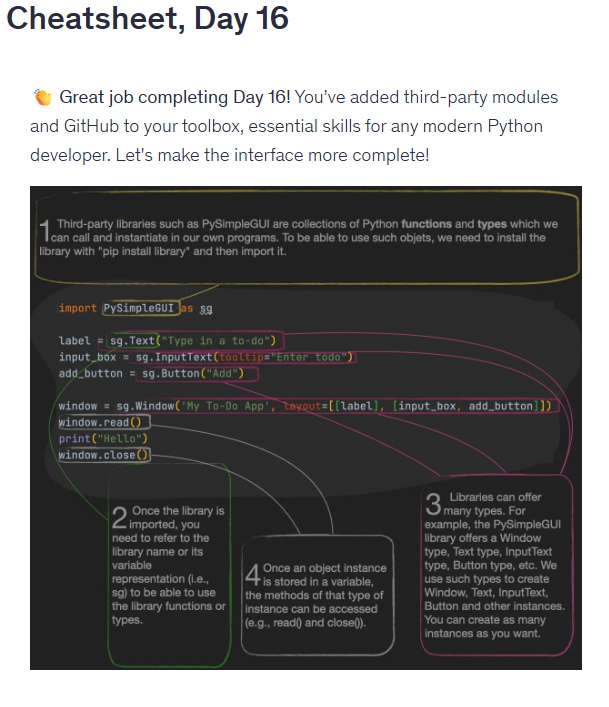
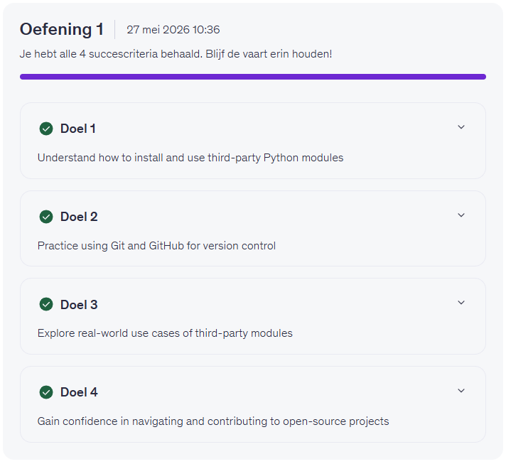

### 🗓️ Week 26W22 (25.05.26 – 29.05.26)

## 📅 Dinsdag 26/05
*Start:* 10:30 | *Einde:* 20:00 |  *Dag: 12, 13, 14, 15 *  
*Onderwerp:* Supercharge Functions with Arguments (Function Arguments, Defaults) 
*Printscreen Day 12*  

  
  *Onderwerp:* Flexible Functions (Default Arguments, Docstrings)  
*Printscreen Day 13*  

  
  *Onderwerp:* Modularize for Maintainability (Local Modules)  
*Printscreen Day 14*  

  
  *Onderwerp:* Built in Tools & Version Control (Standard Modules, Git)  
*Printscreen Day 15*  

  

## 📅 Woensdag 27/05
*Start:* 09:00 | *Einde:* 00:00 | *Dag:*   
*Onderwerp:* Expand with External Libraries (Third-Party Modules, GitHub)  
*Printscreen Day 16*  

## 📅 Donderdag 28/05
*Start:* 00:00 | *Einde:* 00:00 | *Dag:*   
*Onderwerp:* ................  
*Printscreen*

## 📅 Vrijdag 29/05
*Start:* 00:00 | *Einde:* 00:00 | *Dag:*   
*Onderwerp:* ................  
*Printscreen*

