### 🗓️ Week 26W24 (08.06.26 – 12.06.26)

## 📅 Maandag 08/06
*Start:* 09:00 | *Einde:* 00:00 |  *Dag:* 52, 53, 54, 55   
*Onderwerp:* Food Ordering App with Django (Part 1: Setting Up)  
*Printscreen Dag 52*
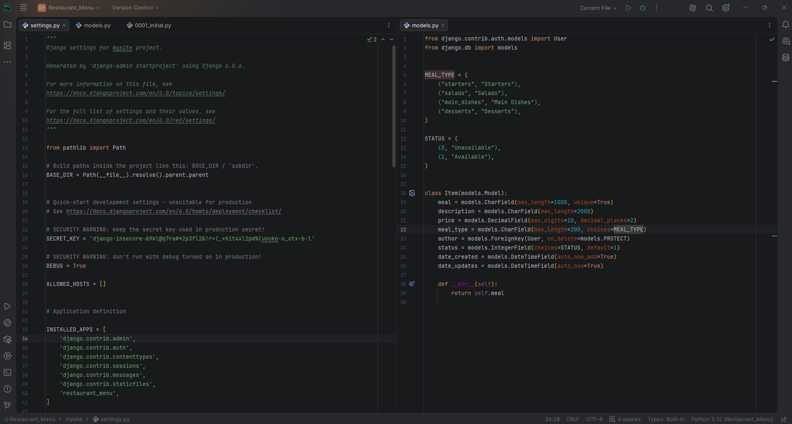
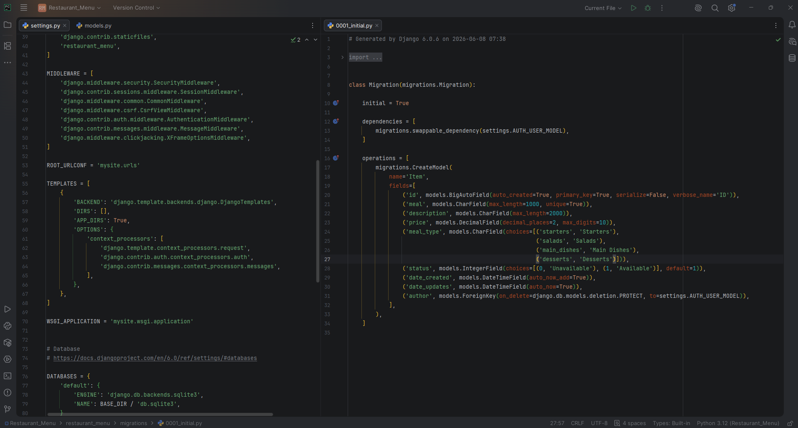
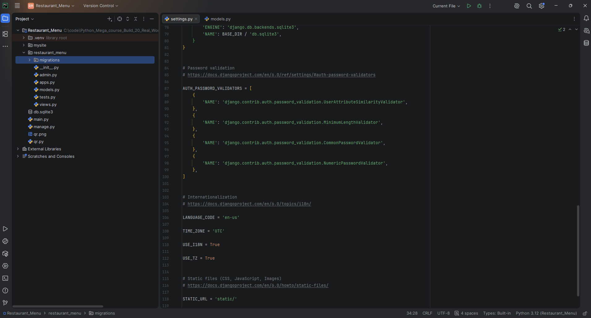  
   *Onderwerp:* Food Ordering App with Django (Part 2: Class-Based Views and Context)  
*Printscreen Dag 53*  
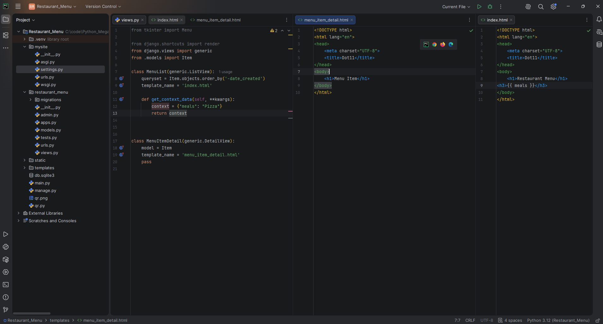
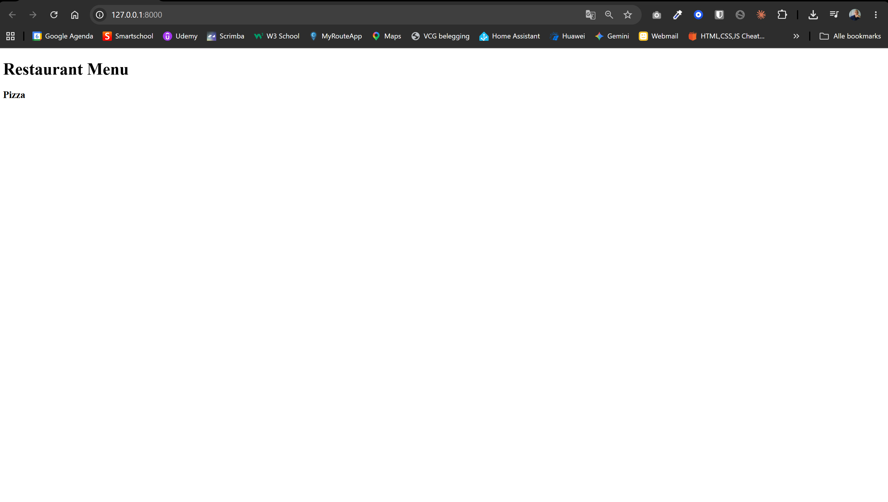  
   *Onderwerp:* Food Ordering App with Django (Part 3: Admin Interface and Bootstrap)  
*Printscreen Dag 54*  
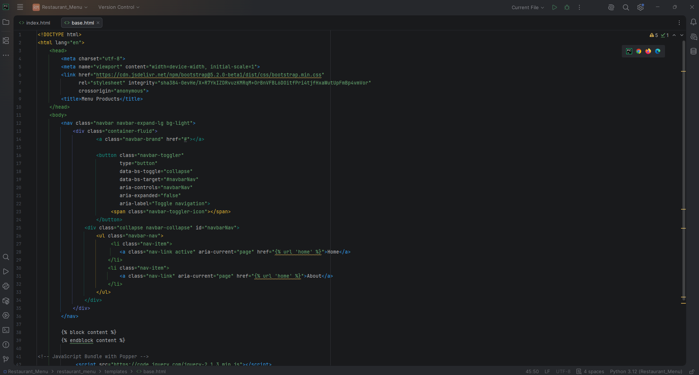
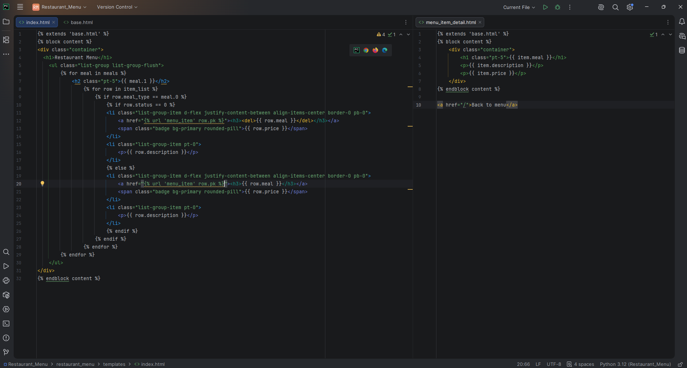
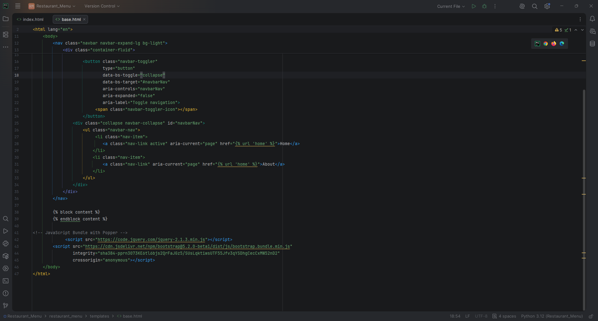
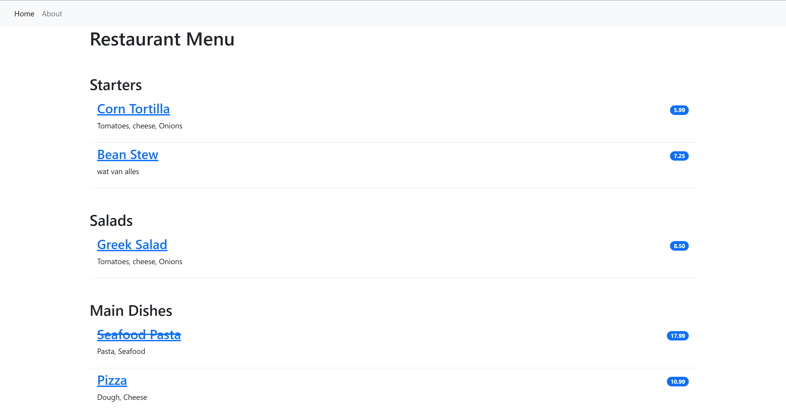
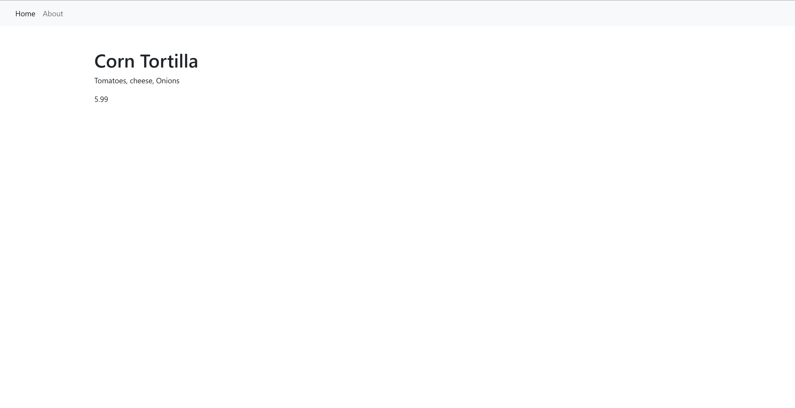  
   *Onderwerp:* Build a Movie Recommendation System (Part 1: Exploring the Dataset)  
*Printscreen Dag 55*  
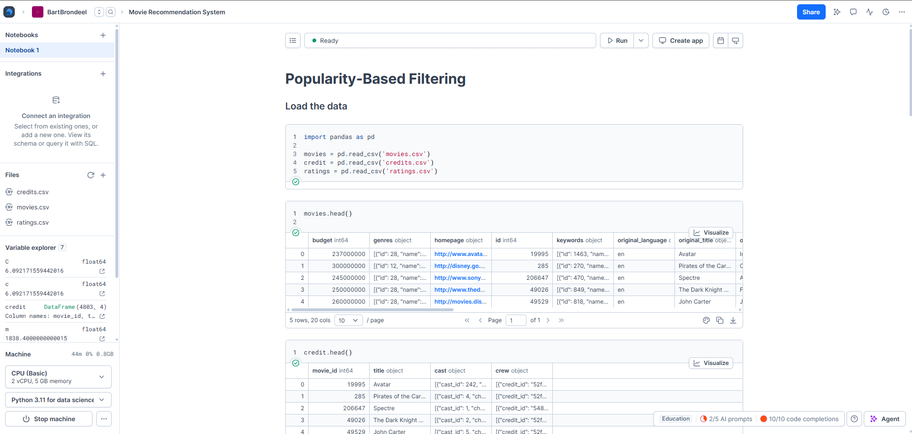
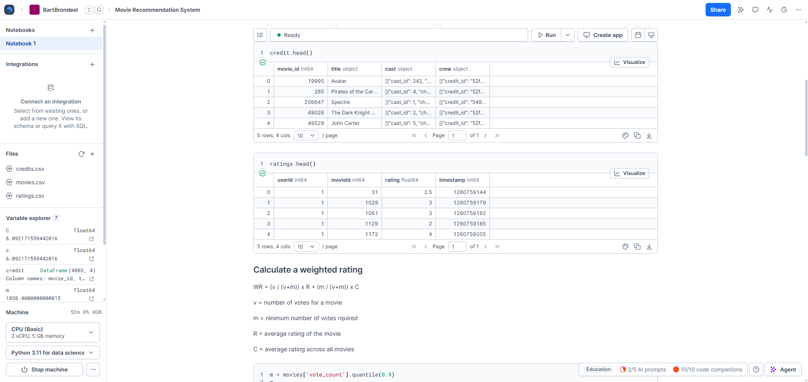
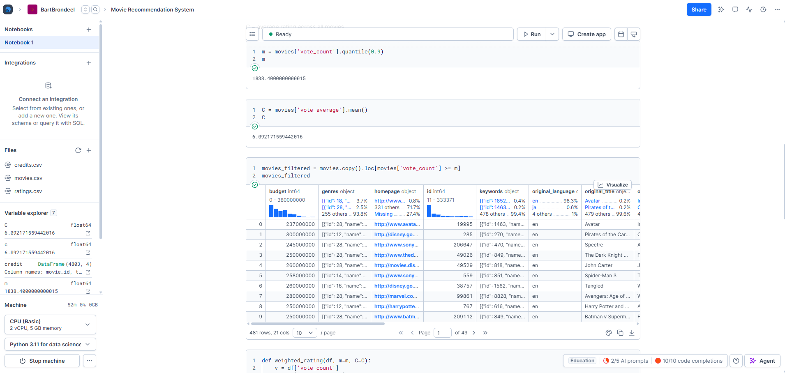
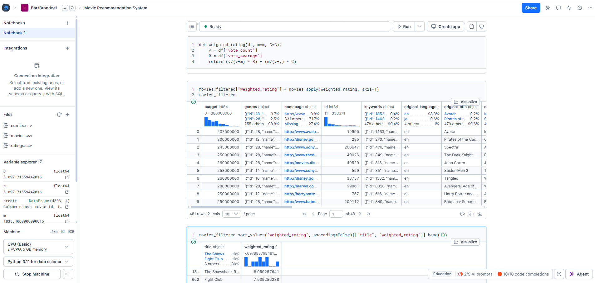
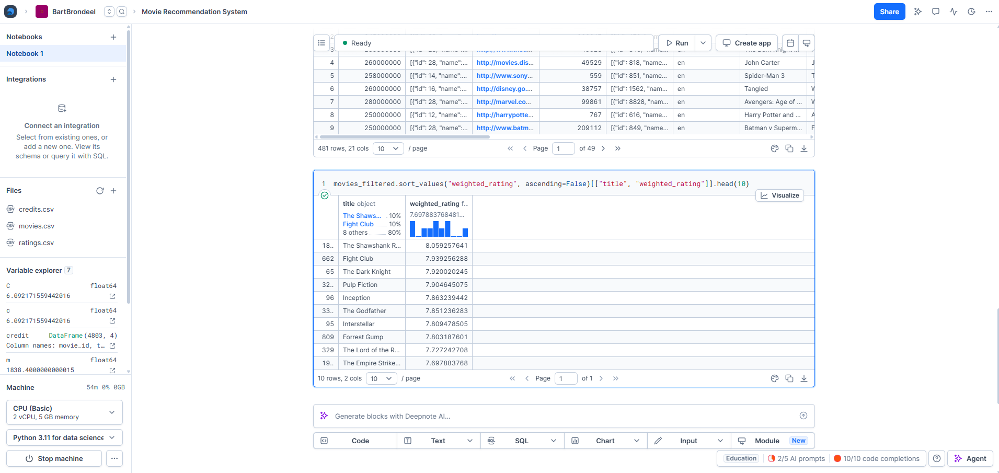  

## 📅 Dinsdag 09/06
*Start:* 00:00 | *Einde:* 00:00 |  *Dag:*  
*Onderwerp:* ................    
*Printscreen*

## 📅 Woensdag 10/06
*Start:* 00:00 | *Einde:* 00:00 | *Dag:*   
*Onderwerp:* ................  
*Printscreen*

## 📅 Donderdag 11/06
*Start:* 00:00 | *Einde:* 00:00 | *Dag:*   
*Onderwerp:* ................  
*Printscreen*

## 📅 Vrijdag 12/06
*Start:* 00:00 | *Einde:* 00:00 | *Dag:*   
*Onderwerp:* ................  
*Printscreen*

